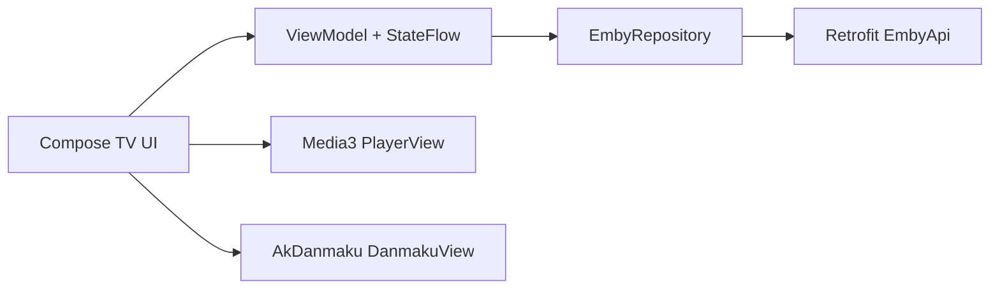

# 技术设计: Emby TV 客户端初始化

## 技术方案
### 核心技术
- Kotlin + Android Gradle Plugin
- Jetpack Compose + AndroidX TV Compose
- AndroidX Media3 ExoPlayer
- 快手 AkDanmaku
- Retrofit + OkHttp
- MVVM + Coroutines + Flow

### 实现要点
- 使用 `DefaultAppContainer` 做轻量手动依赖注入。
- 使用 `HomeViewModel` 维护服务器输入、登录状态和媒体列表。
- 使用 `EmbyRepository` 隔离 Retrofit DTO 和领域模型。
- 使用 `Media3PlayerFactory` 统一配置播放器、OkHttp 数据源和扩展渲染器策略。
- 使用 `AkDanmakuBridge` 隔离 AkDanmaku 数据构造。

## 设计边界
- **范围内:** 工程骨架、关键依赖、Emby 基础 API、播放页、弹幕桥接、知识库。
- **范围外:** 账号持久化、真实弹幕源、复杂播放控制、完整媒体库页面。
- **模块职责:** ui 负责交互；data 负责 Emby；player 负责 Media3；danmaku 负责 AkDanmaku；core 负责装配。
- **接口契约:** Repository 向 ViewModel 返回 `Result`；播放页只消费 `PlaybackSource`。
- **数据边界:** 不写入本地数据库；密码仅存在于当前 UI 状态。
- **依赖边界:** 所有三方版本集中在 `gradle/libs.versions.toml`；FFmpeg 扩展通过本地 AAR 接入。
- **大型项目最小改动:** 新仓库初始化，不涉及遗留代码迁移。

## 架构设计

## 架构决策 ADR
### ADR-001: 使用本地 AAR 预留 Media3 FFmpeg 扩展
**上下文:** AndroidX Media3 的 FFmpeg 扩展不在 Google Maven 的 `androidx.media3` artifact 列表中。
**决策:** 不声明不存在的 Maven 坐标；通过 `app/libs/*.aar` 自动纳入本地构建产物，并在播放器中启用扩展渲染器优先策略。
**理由:** 避免初始化工程因无效依赖无法解析，同时保留后续接入 FFmpeg 解码的路径。
**替代方案:** 直接写入 `androidx.media3:media3-exoplayer-ffmpeg` → 拒绝原因: Google Maven 元数据中不存在该 artifact。
**影响:** 用户需要单独构建 FFmpeg 扩展 AAR；默认无 AAR 时仍可使用 Media3 默认解码。

## API设计
### POST Users/AuthenticateByName
- **请求:** `EmbyAuthRequest`
- **响应:** `EmbyAuthResponse`

### GET Users/{userId}/Items
- **请求:** userId、Recursive、IncludeItemTypes、Fields
- **响应:** `EmbyItemsResponse`

## 数据模型
见 `helloagents/main/wiki/data.md`。

## 安全与性能
- **安全:** 不硬编码任何服务器、账号或令牌；令牌仅来自运行时登录结果。
- **安全:** 当前允许 cleartext 以兼容局域网 Emby，后续发布前应改为 HTTPS 或限定域名。
- **性能:** 播放器使用 OkHttp 数据源；弹幕通过 AkDanmaku 自带缓存和渲染线程处理。

## 测试与部署
- **测试:** 增加 `EmbyStreamUrlBuilderTest` 覆盖播放 URL 与图片 URL 构造。
- **部署:** 通过 Android Studio 或 Gradle Wrapper 构建 debug APK。
