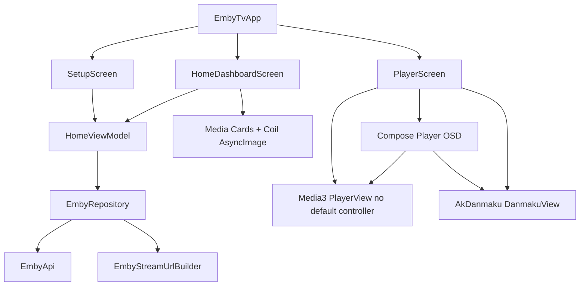

# 技术设计: TV UI 设计稿核心体验落地

## 技术方案

### 核心技术
- Kotlin / Jetpack Compose / AndroidX TV Compose。
- AndroidX Media3 + 现有 `Media3PlayerFactory`。
- AkDanmaku + 现有 `AkDanmakuBridge`。
- Retrofit/OkHttp 与现有 `EmbyRepository`。
- Coil Compose 用于 Emby 图片 URL 加载。执行时需在 `gradle/libs.versions.toml` 和 `app/build.gradle.kts` 增加 `io.coil-kt.coil3:coil-compose`，版本按执行时官方文档确认；当前 Context7 查询到的 Coil Compose 示例版本为 `3.4.0`。

### 实现要点
- 抽取 `CinematicGlassTheme`、设计 token、玻璃面板、焦点容器、媒体卡片、顶部栏、抽屉、状态徽章等组件。
- 将 `HomeUiState` 扩展为可表达连接页、首页内容、加载、错误、选中导航项和迷你播放条状态。
- 保留当前 `HomeViewModel` 的认证与媒体加载流程，新增纯 Kotlin UI 映射/状态 reducer，便于测试。
- 在 `EmbyTvApp` 中用简单页面状态区分配置页、首页和播放页，暂不引入复杂导航框架。
- `PlayerScreen` 关闭 `PlayerView` 默认控制器，使用 Compose OSD 覆盖层实现播放控制 UI；Media3 `Player` 仍由 `Media3PlayerFactory` 创建。
- OSD 的按键逻辑采用 `onPreviewKeyEvent`：OK/方向键显示 OSD，Back 在 OSD 可见时隐藏，否则退出播放页。
- 弹幕开关通过 UI 状态驱动 `DanmakuView` 可见性和 `DanmakuPlayer.pause()/start()`，播放暂停状态同步到弹幕。

## 设计边界
- **范围内:** 设计系统、服务器配置 UI、首页媒体库 UI、播放 OSD UI、弹幕显示/隐藏/暂停同步、图片加载占位、核心状态测试、知识库同步。
- **范围外:** 详情页路由与真实数据、人物/收藏页、真实 Emby Connect 配对、真实音轨/字幕轨道切换、真实搜索页、设置页、持久化登录、多模块拆分。
- **模块职责:** `ui/theme` 提供设计 token；`ui/components` 提供无业务组件；`ui/setup` 负责服务器配置界面；`ui/home` 负责已连接首页和媒体选择；`ui/player` 负责播放器 OSD 和按键交互；`data` 继续负责 Emby API 和媒体 URL。
- **接口契约:** Emby 远端 API 不变；`HomeScreen` 可拆成 `SetupScreen` 与 `HomeDashboardScreen`；`onPlay(PlaybackSource)` 和 `onPlaySample()` 保持播放入口语义；新增内部 OSD 状态模型不暴露到远端 API。
- **数据边界:** 不新增数据库、不迁移数据；当前连接信息仍为运行期内存状态；图片 URL 来自 `MediaItemSummary.imageUrl`。
- **依赖边界:** 新增 Coil Compose 仅用于 Compose 图片加载；不新增导航框架、DI 框架或持久化框架；Media3、AkDanmaku、Retrofit/OkHttp 版本不升级。
- **大型项目最小改动:** 当前项目规模较小，但仍按最小必要范围实施。不重命名包根、不重构 Repository 协议、不拆 Gradle 模块；回滚方式为恢复本方案涉及的 `ui` 文件、Coil 依赖和知识库更新。

## 架构设计

## 架构决策 ADR

### ADR-20260527-01: 首批落地配置-首页-播放主链路
**上下文:** 设计稿覆盖服务器配置、首页、详情、收藏/人物、播放 OSD。一次性实现全部页面会引入路由、元数据、筛选、搜索、演员关联和播放控制等多个不稳定边界。
**决策:** 本方案包只实现“服务器配置 -> 首页媒体库 -> 播放 OSD/弹幕控制”主链路，并把详情页与人物/收藏页列为后续切片。
**理由:** 该链路复用现有认证、媒体列表和播放基础，能形成最短可验证闭环，同时保留后续扩展空间。
**替代方案:** 一次性实现所有设计稿页面 -> 拒绝原因: 任务过大且依赖未建模数据过多，风险不可控。
**影响:** 首轮不会拥有完整详情页与收藏页，但能获得可运行的核心 TV 体验。

### ADR-20260527-02: 使用 Compose OSD 替代 Media3 默认控制器
**上下文:** 设计稿 `osd` 对标题元信息、弹幕快捷设置、音轨/字幕入口、进度条和自动隐藏有明确视觉要求，Media3 默认控制器难以匹配。
**决策:** `PlayerView.useController = false`，播放控件由 Compose 覆盖层实现，底层播放仍使用 Media3。
**理由:** Compose OSD 更容易复用项目主题、焦点态和弹幕设置，也更适合 TV 遥控器按键管理。
**替代方案:** 继续使用 Media3 默认控制器并调整样式 -> 拒绝原因: 样式和交互可控性不足。
**影响:** 需要自行维护 OSD 状态、按键处理和进度同步。

### ADR-20260527-03: 引入 Coil Compose 加载 Emby 图片
**上下文:** 设计稿强依赖海报、背景图和人物图，当前 Compose 代码尚未接入网络图片加载。
**决策:** 新增 Coil Compose 作为唯一图片加载依赖，用于 `MediaItemSummary.imageUrl` 和后续背景图加载。
**理由:** Coil 与 Compose/Kotlin Coroutines 适配成熟，集成成本低，能处理加载、错误、占位和缓存。
**替代方案:** 只使用 AndroidView/ImageView 或手写图片下载 -> 拒绝原因: 维护成本更高且不符合 Compose 组件化方向。
**影响:** 需要记录依赖版本并验证 Debug 构建兼容性。

## API设计
不变更 Emby 远端 API。

内部 UI 状态建议：
- `ConnectionUiState`: serverUrl、username、password、isLoading、errorMessage、pairingCodePlaceholder。
- `DashboardUiState`: libraries、continueWatching、items、selectedNavItem、drawerOpen、miniPlayerVisible。
- `PlayerOsdState`: visible、isPlaying、positionMs、durationMs、danmakuEnabled、danmakuPaused、selectedQuickPanel。

## 数据模型
不新增持久化模型。建议新增或扩展纯 Kotlin UI model：
- `LibrarySummaryUiModel(name, type, countLabel, imageUrl, enabled)`。
- `MediaCardUiModel(id, title, subtitle, imageUrl, progressFraction, badge)`。
- `PlayerQuickSettingUiModel(type, title, subtitle, enabled)`。

## 安全与性能
- **安全:** 不在日志、Toast、错误文案或知识库中输出密码/API Key/AccessToken；手动连接错误只展示可恢复摘要；未实现入口不得请求未知远端服务。
- **性能:** 图片加载使用固定尺寸和 `ContentScale.Crop`；列表使用 `LazyRow`/`LazyColumn`；避免全屏实时高半径模糊，优先用半透明玻璃层和暗色渐变模拟设计；OSD 自动隐藏减少覆盖层重组。
- **EHRB:** 未检测到生产环境、数据库、支付、权限提升或破坏性操作。第三方依赖新增需记录版本并通过构建验证。

## 测试与部署
- **测试:** 对状态 reducer、连接输入校验、首页媒体映射、OSD Back/OK 行为和弹幕开关同步做 JVM 单元测试；Compose 视觉和 TV 焦点以手工截图/设备验证作为 TDD-EXEMPT 补充。
- **验证命令:** `.\gradlew.bat :app:testDebugUnitTest`、`.\gradlew.bat :app:assembleDebug`。
- **手工验收:** 在 Android Studio 模拟器或 TV 设备打开 Debug 包，验证未连接配置页、连接后首页、样例播放、OSD 唤起/隐藏、弹幕开关、返回键路径和 1080p/4K 文本不重叠。
- **部署:** 本方案仅生成 Debug 构建验证，不涉及发布签名或商店分发。
