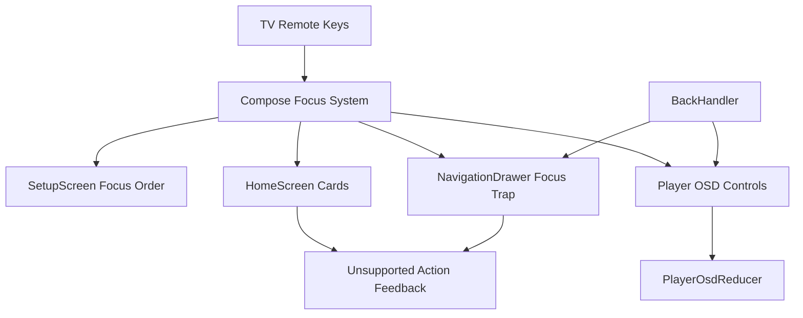

# 技术设计: Android TV 遥控器完整操作支持

## 技术方案

### 核心技术
- Jetpack Compose / AndroidX TV Compose 焦点系统。
- `FocusRequester`、`focusProperties`、`focusGroup`、`BackHandler`、`onKeyEvent`/`onPreviewKeyEvent`。
- 现有 `PlayerOsdState` / `PlayerOsdReducer` 和 `HomeDashboardUiModel`。
- JUnit 单元测试覆盖 reducer 和 UI 状态映射；设备级手工验收覆盖真实焦点搜索。

### 实现要点
- 抽取 `RemoteFocusableSurface` 或增强现有 `FocusableGlassSurface`：支持禁用原因、初始焦点请求、OK/Enter 点击、可选语义描述。
- 抽屉打开时使用 `FocusRequester` 请求关闭按钮或 Home 项焦点，并用 BackHandler 关闭抽屉。
- 首页抽屉导航项变为可聚焦控件；未实现项按禁用态展示并提供统一提示，不触发空页面。
- 首页媒体库卡片不再使用空点击：未实现二级页时禁用或触发“暂未支持媒体库详情”状态提示。
- 播放页根容器不再在 `onPreviewKeyEvent` 中消费方向键和 OK/Enter；只在 OSD 隐藏时通过非抢占式按键唤起 OSD，Back 走 reducer。
- OSD 打开时请求焦点到播放/暂停按钮；所有空行为按钮要么禁用，要么显示“暂未支持”提示。
- 配置页输入框增加明确焦点顺序和 IME action；连接按钮支持 OK/Enter 触发，加载中保持可预测焦点状态。

## 设计边界
- **范围内:** 遥控器方向键、OK/Enter、Back、焦点请求、焦点约束、禁用反馈、输入焦点顺序。
- **范围外:** 新增业务页面、真实音轨/字幕/上一集/下一集能力、完整 UI 自动化测试框架。
- **模块职责:** `ui/components` 提供可复用 TV 焦点组件；`ui/setup` 管理配置页输入焦点；`ui/home` 管理首页和抽屉遥控器闭环；`ui/player` 管理播放 OSD 按键与焦点。
- **接口契约:** 远端 API 不变；内部可新增 UI 状态字段，如 `snackbarMessage`、`disabledReason`、`lastFocusedOsdControl`。
- **数据边界:** 无持久化数据变更；不新增敏感信息输出。
- **依赖边界:** 不新增第三方依赖；继续使用现有 Compose、TV Compose、Media3、AkDanmaku。
- **大型项目最小改动:** 仅修改现有 UI 相关文件和测试，不调整 Gradle 依赖、不迁移目录、不重命名公共包。

## 架构设计

## 架构决策 ADR

### ADR-20260527-04: 使用显式焦点与禁用反馈替代默认焦点猜测
**上下文:** Compose 默认焦点搜索可在简单页面工作，但 TV 端要求每个操作都可预测，当前抽屉和 OSD 存在焦点丢失和空点击风险。
**决策:** 关键容器显式管理初始焦点、Back 行为和禁用反馈；未实现入口不得保留空点击。
**理由:** TV 遥控器没有鼠标兜底，显式焦点契约能降低设备差异风险。
**替代方案:** 继续依赖默认焦点搜索 -> 拒绝原因: 已被审查确认存在不稳定和不完整行为。
**影响:** UI 代码会增加少量焦点状态和测试，但用户操作闭环更可靠。

### ADR-20260527-05: 播放页根容器不抢占方向键和 OK
**上下文:** 当前 `PlayerScreen` 在根 `onPreviewKeyEvent` 中消费方向键和 OK/Enter，可能阻止 OSD 控件正常处理遥控器事件。
**决策:** 根容器只处理 Back 和必要的 OSD 唤起；方向键/OK 优先交给当前聚焦控件。
**理由:** OSD 控件本身是可聚焦按钮，按键事件应由焦点控件完成。
**替代方案:** 保持预览阶段消费后手写焦点移动 -> 拒绝原因: 容易重复实现 Compose 焦点系统，维护成本高。
**影响:** 需要增加 OSD 显示时的初始焦点请求和 OSD 隐藏时的唤起策略。

## API设计
不变更 Emby API。

内部状态建议：
- `UnsupportedAction(message: String)` 用于首页/抽屉/OSD 未实现入口反馈。
- `DrawerUiState(isOpen, restoreFocusTarget)` 用于抽屉焦点恢复。
- `PlayerOsdControl` 枚举用于记录 OSD 默认/上次焦点目标。

## 数据模型
无持久化模型变更。可扩展：
- `HomeNavigationItem(enabled, disabledReason)`。
- `LibrarySummaryUiModel(enabled, disabledReason)`。
- `PlayerQuickSettingUiModel(enabled, disabledReason)`。

## 安全与性能
- **安全:** 不新增敏感信息日志；输入框仍对密码遮罩；错误/提示不包含 Token、密码、API Key。
- **性能:** 焦点状态为轻量 UI 状态，不引入重渲染密集逻辑；避免为每个按键创建复杂对象。
- **EHRB:** 无生产服务、数据库、支付、权限提升或破坏性操作。

## 测试与部署
- **单元测试:** 扩展 `PlayerOsdReducerTest`，覆盖 Back、OSD 唤起、禁用入口反馈、方向键不由 reducer 抢占；扩展 Home/Drawer 状态测试，覆盖禁用项和抽屉关闭行为。
- **构建验证:** `.\gradlew.bat :app:testDebugUnitTest`、`.\gradlew.bat :app:assembleDebug`。
- **手工验收:** 在 Android TV 模拟器或真实设备上用遥控器执行配置页输入、首页打开抽屉、抽屉 Back 关闭、媒体播放、OSD 唤起/操作/隐藏、弹幕开关、未实现入口提示。
- **部署:** Debug 构建验证，不涉及发布签名。
