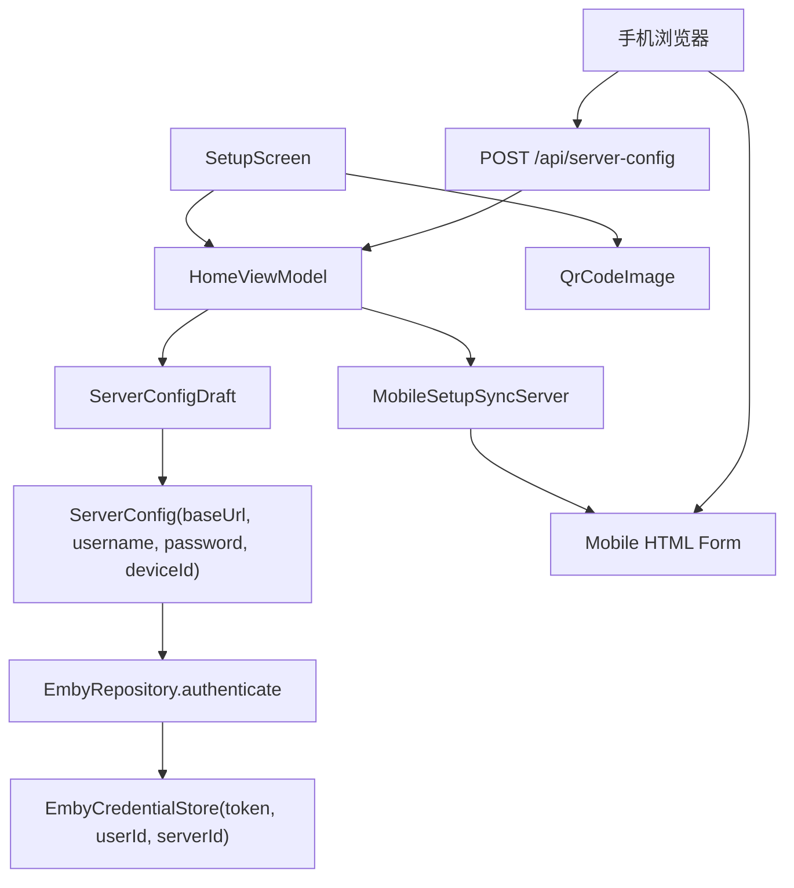

# 技术设计: Emby 服务器配置与手机同步

## 技术方案

### 核心技术
- Kotlin + Jetpack Compose + TV Compose 继续负责 TV 表单和焦点体验。
- ViewModel + StateFlow 继续作为 UI 状态唯一入口。
- 新增 `ServerConfigDraft` 和 `ServerProtocol` 作为结构化配置草稿。
- 新增 `SavedEmbyCredential` 和 `EmbyCredentialStore`，用于保存官方认证返回的访问令牌，并保存 `username` 作为用户身份展示字段；不保存密码。
- 新增二维码生成能力，候选依赖 `com.google.zxing:core:3.5.4`。
- 新增 TV 本机临时 HTTP 同步服务，候选依赖 `org.nanohttpd:nanohttpd:2.3.1`。
- 新增加密凭证存储能力，候选依赖 `androidx.security:security-crypto:1.1.0`。
- 继续复用 Retrofit `EmbyApiFactory`，只改变传入的 `baseUrl` 来源。

### 实现要点
- 把 `HomeUiState.serverUrl` 替换为 `serverHost`、`serverProtocol`、`serverPort`、`serverPath`，保留 `username`、`password`。
- 引入 `ServerConfigDraft.toBaseUrl()`，统一处理协议、主机、端口、路径和尾部 `/`。
- 协议切换时根据“端口是否仍为协议默认端口或为空”决定是否自动改写端口，避免覆盖用户自定义端口。
- `SetupScreen` 手动配置区布局调整为参考图字段：服务器地址、协议选择、端口、路径、用户名、密码。
- `QuickSetupPanel` 从占位配对码改为真实二维码，二维码指向 TV 本机同步页。
- `MobileSetupSyncServer` 在设置页生命周期内启动本机 HTTP 服务，生成一次性 `pair` token，并通过 Flow 向 `HomeViewModel` 推送同步负载。
- 手机页面由 TV 本机服务直接返回 HTML，不依赖外部 Web 服务；表单提交到同一 TV 本机服务。
- `EmbyRepository.authenticate()` 继续使用用户名和密码调用 `/Users/AuthenticateByName`，成功后把 `AccessToken`、`UserId`、`ServerId`、`serverUrl` 和 `username` 写入凭证存储。
- 后续 Emby API 请求携带访问令牌；需要拼接播放直链时只使用 token，不使用用户名和密码。

## 设计边界
- **范围内:** 字段模型、TV 设置页、手机同步页面、二维码、临时本机 HTTP 服务、表单同步事件、连接前校验、官方访问令牌保存策略。
- **范围外:** 云同步、跨公网访问、HTTPS 自签证书、Emby 官方 pin、保存密码、多服务器管理。
- **模块职责:** `ui/setup` 负责展示；`ui/home` 负责状态和事件编排；`domain/model` 负责配置草稿和凭证语义；`core/network` 负责本机同步服务；`data/local` 负责凭证存储；`data/remote` 继续负责 Retrofit baseUrl 规范。
- **接口契约:** `HomeViewModel` 新增结构化字段更新方法和手机同步接收方法；`EmbyRepository.authenticate(ServerConfig)` 保持语义不变；`ServerConfig.baseUrl` 仍是完整 URL。
- **数据边界:** 不落盘保存密码；手机提交内容只进入当前内存态 `HomeUiState`；落盘保存访问令牌、用户 ID、服务器 ID、服务器 URL、设备 ID、用户名展示字段和保存时间。
- **依赖边界:** 新增依赖仅限 QR 编码、本机 HTTP 服务与加密凭证存储；不新增云服务 SDK；不引入大型后端框架。
- **大型项目最小改动:** 项目当前不属于大型项目，但仍按最小必要范围修改，不重构播放、弹幕、首页媒体流。

## 架构设计


## 架构决策 ADR

### ADR-002: 使用 TV 本机临时 HTTP 服务完成手机同步
**上下文:** 手机浏览器需要把填写内容同步到 TV。如果不引入外部中转服务，TV 必须在局域网内提供一个手机可访问入口。

**决策:** TV 设置页启动本机临时 HTTP 服务，二维码指向该服务的手机页面；手机提交后由服务把配置通过 Flow 推送给 `HomeViewModel`。

**理由:** 无需云服务和账号绑定；数据不离开局域网；符合当前单机 TV 客户端阶段；可保留 TV 手动输入兜底。

**替代方案:** 云端 relay 或 WebSocket 中转 → 拒绝原因: 需要额外后端、账号安全和部署成本。  
**替代方案:** QR 编码完整配置后让 TV 扫手机 → 拒绝原因: TV 端通常无摄像头，不符合 Android TV 使用场景。  
**替代方案:** 手机页面使用外部托管站点再回调 TV → 拒绝原因: 引入公网依赖和跨域安全问题。

**影响:** 需要处理局域网访问失败、端口占用、服务生命周期、配对 token 和密码传输风险。

### ADR-003: 保存用户名展示字段，不保存密码，只用 Emby 访问凭证恢复认证
**上下文:** Emby 官方认证流程使用用户名和密码调用 `/Users/AuthenticateByName`，响应中返回访问令牌。官方文档说明该令牌可保存以供后续使用。

**决策:** 密码仅作为登录输入保留在内存；登录成功后保存 `serverUrl`、`userId`、`accessToken`、`serverId`、`deviceId`、`username` 和保存时间。`username` 仅用于多服务器/多用户列表展示，不参与认证恢复。

**理由:** 减少密码泄露面；符合 Emby token 认证模型；后续请求和播放直链只需要访问令牌；保留用户名可以让用户在多个服务器或多个账号之间识别身份。

**替代方案:** 保存用户名和密码用于自动重登 → 拒绝原因: 密码长期落盘风险高，且官方 token 已满足恢复登录态需求。  
**替代方案:** 完全不持久化 token → 拒绝原因: 每次打开 TV 都需要重新输入账号，违背电视端易用性。

**影响:** token 必须按敏感凭证处理；token 失效时需要清理凭证并引导用户重新登录。

## API设计

### POST /Users/AuthenticateByName
- **请求:** `Username`、`Pw`。
- **响应:** `AccessToken`、`User.Id`、`ServerId` 等认证信息。
- **客户端处理:** 登录成功后保存访问令牌、会话标识和用户名展示字段，不保存密码。

### GET /Users/{userId}/Items
- **请求:** 使用访问令牌认证，继续携带客户端标识、设备名、设备 ID 和版本号。
- **响应:** 媒体条目列表。
- **客户端处理:** 如果返回未授权或 token 失效，清理本地凭证并回到设置页。

### GET /
- **描述:** 返回手机配置页面。
- **查询:** `pair=<token>`，必须匹配 TV 端当前 token。
- **响应:** `text/html; charset=utf-8`，包含同一组配置字段和同步按钮。

### POST /api/server-config
- **描述:** 手机页面同步配置到 TV。
- **请求:** `application/json` 或 `application/x-www-form-urlencoded`，执行阶段优先选择更易兼容手机浏览器的 form-urlencoded。
- **字段:**
  - `pair`: 当前一次性配对令牌，必填。
  - `protocol`: `https` 或 `http`，必填。
  - `host`: 服务器地址，必填。
  - `port`: 1 到 65535，必填。
  - `path`: 可选。
  - `username`: 必填。
  - `password`: 可为空。
- **响应:** `{ "ok": true, "message": "已同步到电视" }` 或 `{ "ok": false, "message": "错误原因" }`。

## 数据模型
```kotlin
enum class ServerProtocol(val scheme: String, val defaultPort: Int) {
    Https("https", 443),
    Http("http", 8096),
}

data class ServerConfigDraft(
    val protocol: ServerProtocol = ServerProtocol.Https,
    val host: String = "",
    val port: String = ServerProtocol.Https.defaultPort.toString(),
    val path: String = "",
    val username: String = "",
    val password: String = "",
)

data class MobileSetupSyncUiState(
    val isRunning: Boolean = false,
    val qrUrl: String? = null,
    val pairingCode: String? = null,
    val errorMessage: String? = null,
)

data class SavedEmbyCredential(
    val serverUrl: String,
    val userId: String,
    val username: String,
    val accessToken: String,
    val serverId: String?,
    val deviceId: String,
    val savedAtEpochMillis: Long,
)
```

## 安全与性能
- **安全:** 同步服务只绑定设置页生命周期；token 使用高熵随机值；token 单次使用或短时过期；请求体不进入日志；密码只保留内存态；手机页面不从 URL 传递密码。
- **安全:** `AccessToken` 使用 Android 私有加密存储；不在日志、错误文案、URL 或手机页面中回显 token。
- **安全:** 如果无法确定局域网 IP 或端口被占用，显示可恢复错误并保留手动输入。
- **性能:** 同步服务仅在初始化设置页运行；二维码仅在 URL 变化时重新生成；手机 HTML 使用内联静态页面，避免资源请求。
- **兼容:** HTTPS 作为 Emby 连接协议，不代表手机同步页使用 HTTPS；手机同步页默认使用局域网 HTTP，因为 TV 端没有可信证书。

## 测试与部署
- **测试:** 强制 TDD 覆盖 `ServerProtocol` 默认端口、`ServerConfigDraft.toBaseUrl()`、路径规范化、输入校验、手机同步 payload 到 `HomeUiState` 的状态更新、认证成功后保存用户名展示字段但不保存密码。
- **测试:** 对本机 HTTP 服务做 JVM 可运行的路由/解析测试；如 Android 环境限制导致无法纯 JVM 启动服务，则抽出 parser 和 handler 做单元测试，服务生命周期用手工验收补充。
- **部署:** 执行 `.\gradlew.bat :app:testDebugUnitTest` 与 `.\gradlew.bat :app:assembleDebug`；在 Android TV 模拟器或真实设备上验证手机扫码同步。
