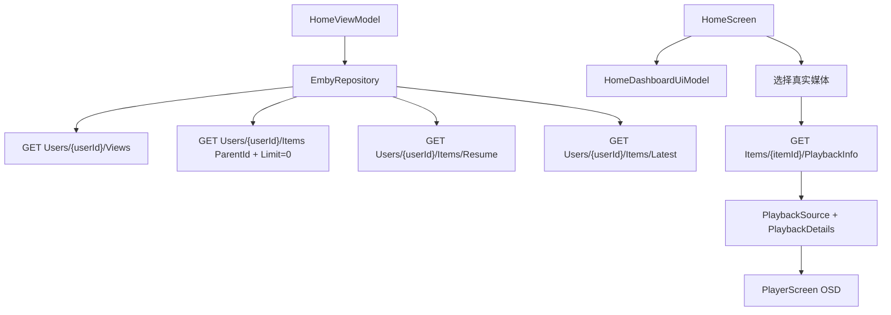

# 技术设计: 全量替换为 Emby 真实数据

## 技术方案

### 核心技术
- Retrofit + OkHttp 扩展 Emby API。
- Kotlin DTO + 领域模型映射真实 Emby 字段。
- MVVM + StateFlow 管理首页和播放详情加载状态。
- AndroidX Media3 继续使用 Emby stream URL 播放，OSD 展示数据来自 `PlaybackInfo`。

### 实现要点
- 新增 API：`getViews`、`getItemsByParent`、`getResumeItems`、`getLatestItems`、`getPlaybackInfo`。
- Repository 新增 `loadHomeDashboard(session, deviceId)`，聚合 Views、库数量、Resume 和 Latest。
- 避免 `Users/{userId}/Items` 一次拉全量；首页最多取必要数量。
- `HomeDashboardMapper` 改为纯真实数据映射，移除 `seededProgress()` 和硬编码库卡片。
- `PlaybackSource` 扩展为携带 `PlaybackDetails`，包含媒体源、视频流、音频流、字幕流、质量标签和播放会话 ID。
- `PlayerScreen` 的 `Direct Playing · HEVC · 4K HDR`、`2160p · HDR10` 改用 `PlaybackDetails` 生成。
- `AppContainer`、`EmbyTvApp`、`HomeScreen` 移除样例播放入口。

## 设计边界
- **范围内:** 首页所有可见媒体数据、播放器 OSD 媒体信息、生产样例入口移除。
- **范围外:** Emby 播放进度回写、真实弹幕源、音轨/字幕切换实际生效、多服务器管理、分页列表页。
- **模块职责:** data 负责接口与 DTO；domain 负责真实数据模型；ui/home 负责首页展示；ui/player 负责 OSD 展示；core/di 不再提供样例播放。
- **接口契约:** Repository 新增 dashboard 和 playback info 聚合方法；现有 `authenticate` 和 credential 语义保持不变。
- **数据边界:** 不记录具体私有媒体标题到知识库；测试使用 fake DTO 或结构样本，不依赖真实服务器。
- **依赖边界:** 不新增第三方依赖。
- **大型项目最小改动:** 保持现有 MVVM 和 Compose 结构，只替换数据源与模型，不重构播放器生命周期和弹幕层。

## 架构设计


## 架构决策 ADR

### ADR-004: 首页使用聚合接口替代全量 Items 拉取
**上下文:** 测试服务器 `Movie,Episode` 全量递归返回 45661 条，直接作为首页数据源会影响启动性能。

**决策:** 首页使用 `Views`、按 View 的 `Limit=0` 统计、`Items/Resume` 和 `Items/Latest` 聚合，不再启动时拉取全部 Movie/Episode。

**理由:** 能满足首页真实展示，并显著降低数据量和响应时间。

**替代方案:** 保持全量 `Users/{userId}/Items?Recursive=true` → 拒绝原因: 数据量过大且仍无法提供真实继续观看语义。

**影响:** Repository 需要聚合多个接口；媒体库数量统计会产生多个请求，需限制并发或串行加载。

## API设计

### GET Users/{userId}/Views
- **用途:** 首页媒体库卡片。
- **关键字段:** `Id`、`Name`、`Type`、`CollectionType`、`ChildCount`、`ImageTags`。

### GET Users/{userId}/Items?ParentId={viewId}&Recursive=true&IncludeItemTypes=Movie,Episode&Limit=0
- **用途:** 媒体库视频数量。
- **关键字段:** `TotalRecordCount`。

### GET Users/{userId}/Items/Resume
- **用途:** Continue Watching。
- **关键字段:** `Id`、`Name`、`SeriesName`、`SeasonName`、`ImageTags`、`RunTimeTicks`、`UserData.PlaybackPositionTicks`、`UserData.PlayedPercentage`。

### GET Users/{userId}/Items/Latest
- **用途:** 最近入库兜底列表。
- **注意:** 返回数组，不是 `Items` 包装对象。

### GET Items/{itemId}/PlaybackInfo?UserId={userId}
- **用途:** 播放器 OSD 真实格式、音轨、字幕。
- **关键字段:** `PlaySessionId`、`MediaSources[].Container`、`MediaSources[].Bitrate`、`MediaSources[].MediaStreams[]`。

## 数据模型
```kotlin
data class EmbyHomeDashboard(
    val libraries: List<EmbyLibrarySummary>,
    val resumeItems: List<MediaItemSummary>,
    val latestItems: List<MediaItemSummary>,
)

data class MediaItemSummary(
    val id: String,
    val name: String,
    val type: String,
    val overview: String?,
    val imageUrl: String?,
    val seriesName: String?,
    val seasonName: String?,
    val runTimeTicks: Long?,
    val playbackPositionTicks: Long,
    val playedPercentage: Double?,
    val productionYear: Int?,
)

data class PlaybackDetails(
    val playSessionId: String?,
    val mediaSourceId: String?,
    val container: String?,
    val videoCodec: String?,
    val videoWidth: Int?,
    val videoHeight: Int?,
    val videoRange: String?,
    val audioTracks: List<PlaybackTrack>,
    val subtitleTracks: List<PlaybackTrack>,
)
```

## 安全与性能
- **安全:** 真实服务器探测结果只写结构，不写 token、密码、具体媒体标题。
- **安全:** API 错误日志不得输出 `api_key` 或完整播放 URL。
- **性能:** 首页列表使用 `Limit`；库数量统计优先串行或小并发，避免压垮低性能 NAS。
- **性能:** `PlaybackInfo` 在用户点击媒体时加载，不在首页批量加载所有条目。

## 测试与部署
- **测试:** TDD 覆盖 DTO 映射、真实进度计算、空字段兜底、PlaybackInfo 格式标签生成、样例入口移除。
- **验证:** `.\gradlew.bat :app:testDebugUnitTest`、`.\gradlew.bat :app:assembleDebug`。
- **手工:** 用测试服务器登录后确认首页卡片、继续观看、最近入库、播放器格式均为真实数据。
