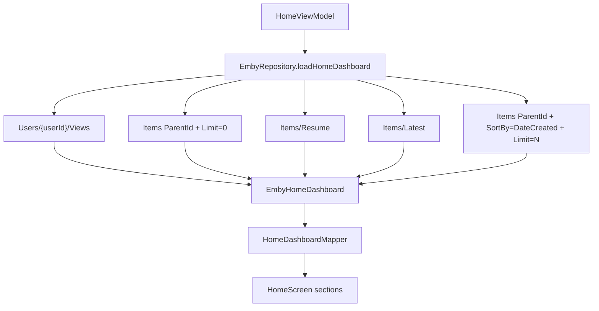

# 技术设计: 首页媒体库与最新资源展示增强

## 技术方案

### 核心技术
- Kotlin data class 扩展领域模型。
- Retrofit 复用 Emby `Users/{userId}/Items` 查询接口。
- Repository 聚合 `Views`、继续观看、全局最新和按库最新。
- Jetpack Compose + TV Compose 焦点控件渲染首页纵向分区。

### 实现要点
- 在领域层新增 `EmbyLibraryLatestSection(library, items)`，并在 `EmbyHomeDashboard` 中增加 `libraryLatestSections`。
- 扩展 `MediaItemSummary`，补充 `thumbImageUrl`、`backdropImageUrl`、`parentIndexNumber`、`indexNumber`、`parentId` 等字段，用于缩略图和集信息展示。
- 扩展 DTO `EmbyItemDto`，补齐 `ParentId`、`ParentIndexNumber`、`IndexNumber`、`BackdropImageTags` 等可空字段。
- 在 `EmbyStreamUrlBuilder` 新增可复用图片 URL 构造，支持 Primary/Thumb/Backdrop 类型。
- 在 `EmbyApi` 中新增或调整按 `ParentId` 拉取库内最新条目的方法，参数包含 `SortBy=DateCreated`、`SortOrder=Descending`、`Limit`、`Fields`。
- `EmbyRepository.loadHomeDashboard()` 在 Views 和库统计后，为每个库加载最新条目，并过滤空分区。
- `HomeDashboardMapper` 输出继续观看卡片和多个库分区 UI 模型，Episode 副标题由 `seriesName + season/index` 等真实字段组合。
- `HomeScreen` 将主内容改为纵向可滚动分区: 媒体库、继续观看、每库最新资源；每个资源横排仍使用遥控器可聚焦卡片。

## 设计边界
- **范围内:** 首页数据模型、Emby 聚合接口、图片 URL 选择、Episode 展示文案、首页分区 UI、自动化测试、知识库。
- **范围外:** 媒体库详情页、媒体详情页、分页加载、缓存策略、搜索筛选、播放历史回写。
- **模块职责:** data 负责 Emby 接口和聚合；domain 负责 Dashboard 结构；ui/home 负责显示和遥控器操作；components 只补通用卡片能力。
- **接口契约:** 保留现有 `loadHomeDashboard(session, deviceId)` 对 ViewModel 的入口；返回的 `EmbyHomeDashboard` 字段扩展但不改变认证和播放入口语义。
- **数据边界:** 不新增本地数据库；不保存最新资源列表；知识库只记录字段结构，不记录私有媒体标题。
- **依赖边界:** 不新增第三方依赖。
- **大型项目最小改动:** 保持现有 MVVM、Repository 和 Compose 组件结构，不做目录搬迁、依赖升级或首页整体重写。

## 架构设计


## 架构决策 ADR

### ADR-005: 首页按库最新资源使用 ParentId 查询而非全局 Latest 后本地分组
**上下文:** 用户要求“各个媒体库最新的几条媒体资源”。全局 `Items/Latest` 只能得到跨库混合结果，可能导致部分媒体库没有展示。

**决策:** 对每个媒体库 View 使用 `Users/{userId}/Items?ParentId={viewId}&Recursive=true&IncludeItemTypes=Movie,Episode&SortBy=DateCreated&SortOrder=Descending&Limit=N` 查询最新条目。

**理由:** 语义直接，能保证每个有内容的库都拥有自己的最新资源分区，同时避免一次性全量拉取。

**替代方案:** 继续使用全局 `Items/Latest` 后按 `ParentId` 本地分组 → 拒绝原因: 数量受全局 Limit 影响，不能保证每个库都有数据。

**影响:** 首页请求数随媒体库数量增加；需限制每库数量，并保留可空兜底。

## API设计

### GET Users/{userId}/Items?ParentId={viewId}
- **用途:** 查询指定媒体库最新资源。
- **请求参数:**
  - `ParentId`: 媒体库 View Id。
  - `Recursive=true`: 递归查找库内视频。
  - `IncludeItemTypes=Movie,Episode`: 首版只展示可播放电影和剧集。
  - `SortBy=DateCreated`: 按入库时间排序。
  - `SortOrder=Descending`: 最新在前。
  - `Limit=8`: 每库限制少量卡片，具体值实现中可常量化。
  - `Fields=MEDIA_ITEM_FIELDS`: 包含图片、用户数据、季集信息。

### 图片 URL
- Primary: `/Items/{itemId}/Images/Primary?tag={tag}`
- Thumb: `/Items/{itemId}/Images/Thumb?tag={tag}`
- Backdrop: `/Items/{itemId}/Images/Backdrop/0?tag={tag}`

## 数据模型
```kotlin
data class EmbyHomeDashboard(
    val libraries: List<EmbyLibrarySummary> = emptyList(),
    val resumeItems: List<MediaItemSummary> = emptyList(),
    val latestItems: List<MediaItemSummary> = emptyList(),
    val libraryLatestSections: List<EmbyLibraryLatestSection> = emptyList(),
)

data class EmbyLibraryLatestSection(
    val library: EmbyLibrarySummary,
    val items: List<MediaItemSummary>,
)

data class MediaItemSummary(
    val id: String,
    val name: String,
    val type: String,
    val overview: String?,
    val imageUrl: String?,
    val thumbImageUrl: String?,
    val backdropImageUrl: String?,
    val seriesName: String?,
    val seasonName: String?,
    val parentIndexNumber: Int?,
    val indexNumber: Int?,
    val parentId: String?,
)
```

## 安全与性能
- **安全:** 不输出访问令牌、完整播放 URL、真实媒体标题到日志和知识库；测试使用构造样本。
- **安全:** 图片 URL 只使用 itemId 和 image tag，不额外暴露凭证。
- **性能:** 每库最新资源限制条数，避免全量拉取；如媒体库数量较多，后续可引入并发限制或缓存，本次保持简单串行。
- **性能:** UI 使用 LazyColumn/LazyRow，避免一次性布局过多卡片。

## 测试与部署
- **测试:** 更新 Repository fake 测试，断言按 ParentId 查询库内最新；更新 Mapper 测试，断言媒体库名称/封面、Episode 副标题、库分区 UI。
- **测试:** 保留现有播放入口测试，确保点击库分区条目仍可生成 `PlaybackSource`。
- **部署:** 使用 JDK 17 运行 `.\gradlew.bat :app:testDebugUnitTest` 和 `.\gradlew.bat :app:assembleDebug`。
- **手工:** 真实 TV 上登录 Emby，确认媒体库封面、继续观看缩略图和各媒体库最新资源分区显示正常，并可用遥控器横向移动焦点。
