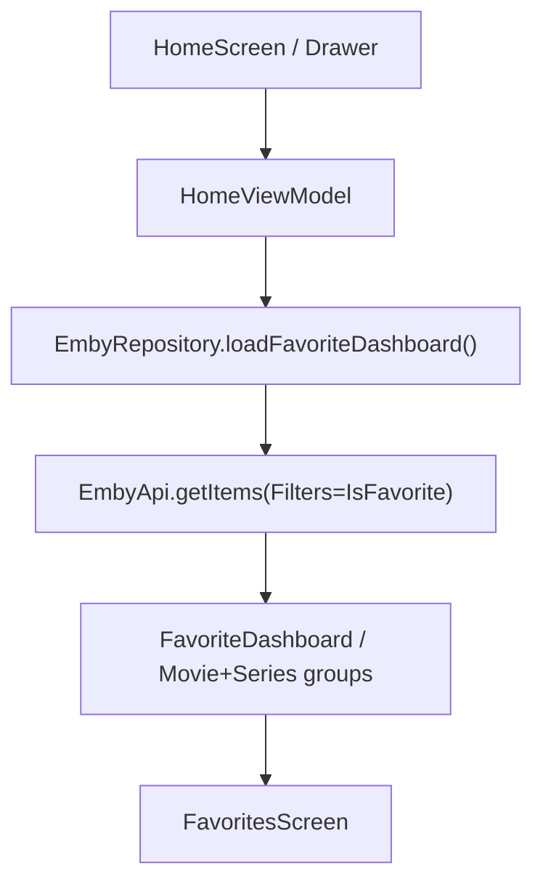

# 技术设计: 收藏资源按电影/电视剧分组展示

## 方案选择

### 方案1（收藏单次拉取 + 本地分组，推荐）
- 使用 `Users/{userId}/Items` 一次性拉取收藏资源。
- 通过 `Filters=IsFavorite` 过滤收藏内容，再用 `IncludeItemTypes=Movie,Series,Episode` 覆盖电影、剧集和收藏到单集的场景。
- 客户端本地拆分为“电影 / 电视剧”两个维度，电视剧侧优先保留 Series，必要时把 Episode 聚合回 Series。
- 优点: 请求少、UI 一致、对 TV 更稳定。
- 缺点: 客户端分组逻辑更复杂。

### 方案2（电影 / 电视剧分别查询）
- 电影和电视剧分别发两次收藏查询。
- 优点: 分组逻辑更直观。
- 缺点: 请求更多，分页与缓存策略会被拆散。

### 方案3（只在首页追加收藏区块）
- 不做独立收藏页，只在首页追加收藏推荐区块。
- 优点: 最少改动。
- 缺点: 不满足“收藏展示界面”的需求，不推荐。

本次采用方案1。

## 技术方案
### 核心技术
- 继续使用现有 MVVM + Kotlin Coroutines + Flow。
- 复用当前 `HomeViewModel` / `HomeScreen` 状态管理方式。
- 继续使用 Retrofit + OkHttp 调用 Emby API。

### 实现要点
- 新增收藏聚合领域模型，承载电影列表和电视剧列表。
- 新增收藏页面 UI 状态，支持加载、空、错误、返回、切换。
- 收藏媒体卡片必须复用或等价实现现有 `MediaPosterCard` 的图片与标题展示能力，确保每个资源都有图片区域和名字文本。
- 图片优先使用 `MediaItemSummary.imageUrl`，再按 `thumbImageUrl`、`backdropImageUrl` 兜底；仍缺图时显示本地占位图。
- 名字优先使用 `MediaItemSummary.name`，电视剧聚合时优先使用 `seriesName`，仍缺失时用 item id 兜底。
- 收藏页入口优先放入现有抽屉或首页主导航，不引入 Navigation 框架。
- 电影卡片保持可播放；电视剧卡片保持浏览态，若详情页未实现则给出明确反馈，不允许空响应。

## 设计边界
- **范围内:** 收藏查询、收藏分组展示、电影/电视剧切换、遥控器返回、空态/错误态、知识库同步。
- **范围外:** 收藏增删、筛选排序、搜索、批量操作、详情页、无限分页。
- **模块职责:** data 负责 Emby 收藏查询与分组，domain 负责收藏聚合模型，ui 负责收藏页与切换交互。
- **接口契约:** 在 `EmbyApi` 中补充收藏过滤参数；Repository 新增收藏读取方法；ViewModel 暴露收藏页打开/关闭与切换状态。
- **数据边界:** 收藏页面只读，不写库；继续复用当前加密凭证与会话状态。
- **依赖边界:** 不新增第三方依赖，沿用现有 Compose / TV Compose / Retrofit / Flow 依赖。
- **大型项目最小改动:** 仅改动收藏链路涉及的 API、Repository、ViewModel、首页 UI 和测试文件，不做导航重构或数据库引入。

## 架构设计


## 架构决策 ADR
### ADR-007: 收藏页采用单次收藏拉取 + 客户端分组
**上下文:** 需要在 TV 端同时展示电影和电视剧两个收藏维度，且收藏可能来自 Movie、Series 或 Episode。
**决策:** 使用一次收藏查询拉取原始结果，在客户端拆分为电影和电视剧两个分组，并对 Episode 收藏做 Series 聚合兜底。
**理由:** 这样能减少网络请求，保证 TV 页面的统一行为，也更容易复用现有媒体卡片和焦点逻辑。
**替代方案:** 电影/电视剧分开请求 → 被拒绝原因: 请求多、分页复杂度高、缓存与空态处理更分散。
**影响:** Repository 需要增加收藏聚合方法，UI 需要新增收藏页面状态与两个维度的切换逻辑。

## API设计
### GET `Users/{userId}/Items`
- **请求:** `Filters=IsFavorite&IncludeItemTypes=Movie,Series,Episode&Recursive=true&StartIndex=0&Limit=60&SortBy=DateCreated&SortOrder=Descending&EnableUserData=true`
- **响应:** 复用现有 `EmbyItemsResponse` 和 `EmbyItemDto`

**说明:**
- `Filters` 采用 Emby 官方收藏过滤能力。
- `IncludeItemTypes` 覆盖电影、剧集和收藏到单集的情况。
- `EnableUserData=true` 让客户端可直接读取 `IsFavorite`、`UnplayedItemCount`、`PlaybackPositionTicks` 等字段。

## 数据模型
```kotlin
data class EmbyFavoriteDashboard(
    val movies: List<MediaItemSummary>,
    val series: List<MediaItemSummary>,
    val totalCount: Int,
)
```

UI 展示模型必须包含:
- `title`: 资源名字，不能为空。
- `imageUrl`: 资源图片地址，可为空但必须触发占位图。
- `subtitle`: 年份、类型、未播放集数或基础信息。

可选扩展:
- `FavoriteCategory` 枚举，值为 `Movie` / `Series`
- `FavoriteUiState` 保存当前选中的分组、加载状态和错误状态

## 安全与性能
- **安全:** 不在 URL、日志、错误文案里输出 token、密码或完整播放地址。
- **性能:** 收藏页采用固定首屏上限，避免一次性拉取过多资源；电视剧侧本地聚合时使用 `SeriesId` 去重，避免重复卡片。
- **兼容性:** 如果服务器版本对收藏过滤或 `IncludeItemTypes` 的组合表现不一致，先保留更保守的 fallback 分组策略。

## 测试与部署
- **测试:** 先写 Repository/Mapper/ViewModel 的失败测试，再补生产实现。
- **部署:** 通过 `.\gradlew.bat :app:testDebugUnitTest` 和 `.\gradlew.bat :app:assembleDebug` 验证后，再做 TV 真机/模拟器手工检查。
