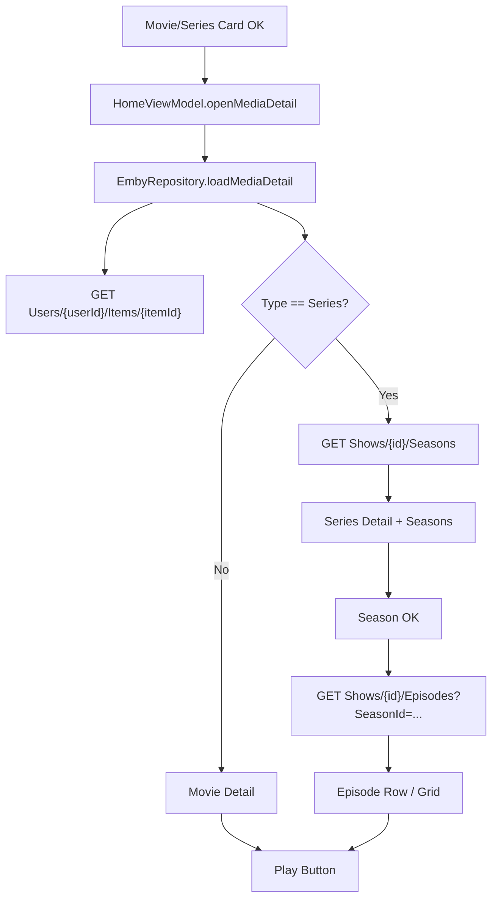

# 技术设计: 媒体详情页与电视剧季列表

## 方案选择

### 方案1（统一媒体详情页 + 电视剧季/集渐进加载，推荐）
- 所有 Movie/Series 卡片 OK 进入统一详情页。
- 先调用 `Users/{userId}/Items/{itemId}` 获取详情基础信息。
- 如果类型为 Series，再调用 `Shows/{id}/Seasons` 获取季列表。
- 用户选择某一季时，再调用 `Shows/{id}/Episodes?SeasonId=...` 获取该季剧集。
- 优点: 符合 Emby 数据模型，请求按需触发，TV 端体验清晰。
- 缺点: ViewModel 状态和 UI 层级增加。

### 方案2（Series 直接进入季列表，Movie 保持直接播放）
- 只为电视剧新增详情/季列表，电影仍直接播放。
- 优点: 改动较少。
- 缺点: 不满足“电影、电视剧这种媒体资源按确认后展示详情”的要求，电影缺少简介/演员。

### 方案3（预加载所有详情和剧集）
- 首页或媒体库列表预先加载详情、季和集。
- 优点: 详情页切换快。
- 缺点: 请求量大，TV 首屏性能差，不推荐。

本次采用方案1。

## 技术方案
### 核心技术
- 继续使用 Retrofit + OkHttp 调用 Emby API。
- 继续使用 MVVM + Kotlin Coroutines + Flow 管理页面状态。
- 继续复用 Compose / TV Compose 现有 `MediaPosterCard`、`PrimaryTvButton`、`GlassPanel` 等组件。

### 实现要点
- `EmbyApi` 新增:
  - `GET Users/{userId}/Items/{itemId}`
  - `GET Shows/{seriesId}/Seasons`
  - `GET Shows/{seriesId}/Episodes`
- `EmbyItemDto` 扩展可空字段:
  - `People`、`Genres`、`Studios`、`CommunityRating`、`CriticRating`、`OfficialRating`、`PremiereDate`
- `EmbyRepository` 新增:
  - `loadMediaDetail(session, deviceId, itemId)`
  - `loadSeasonEpisodes(session, deviceId, seriesId, seasonId)`
- 领域模型新增:
  - `EmbyMediaDetail`
  - `EmbySeasonSummary`
  - `EmbySeasonEpisodes`
  - `EmbyPersonSummary`
- UI 状态新增:
  - `MediaDetailUiState`
  - 当前详情层级: 详情加载中、详情已加载、季内剧集加载中、季内剧集已加载、错误
- `HomeScreen` 改造:
  - 首页横排、媒体库列表、收藏列表中 Movie/Series 卡片点击改为 `openMediaDetail(item)`
  - Episode 卡片可继续直接播放，或者进入 Episode 详情；本方案为最小闭环，Episode 保持直接播放
  - 详情页 Movie 播放按钮调用既有 `createPlaybackSource`
  - Series 季卡片 OK 加载季内 Episode 列表
- 详情页 TV 焦点:
  - 页面进入后焦点在返回按钮或播放按钮。
  - Movie 详情优先聚焦播放按钮。
  - Series 详情优先聚焦第一季；无季时聚焦返回按钮。
  - Back 从剧集列表返回季列表；再 Back 关闭详情页。

## 设计边界
- **范围内:** 详情 API、People/Overview 展示、电视剧季列表、季角标、季内 Episode 列表、遥控器返回链路。
- **范围外:** 收藏管理、演员详情、推荐资源、分页、播放队列、Episode 独立详情页。
- **模块职责:** data 负责 Emby API 和模型聚合；domain 负责详情/季/人物模型；ui/home 负责状态机和页面渲染；ui/components 仅在需要时补可复用小组件。
- **接口契约:** 保持现有 `createPlaybackSourceWithDetails` 不变；新增详情读取方法，不改变认证和播放上报接口。
- **数据边界:** 不引入本地数据库，不缓存详情；详情数据只存在内存 UI state。
- **依赖边界:** 不新增第三方依赖。
- **大型项目最小改动:** 不引入 Navigation 框架，不改目录结构，不批量重构 HomeScreen；只在现有 HomeViewModel/HomeScreen 结构内新增一个详情 overlay 状态。

## 架构设计


## 架构决策 ADR
### ADR-008: 详情页采用按需加载而非列表预加载
**上下文:** 电影和电视剧详情需要额外字段，电视剧还需要季和集数据。  
**决策:** 卡片按 OK 后再加载详情；Series 详情页加载季列表；季内 Episode 在用户选择季后加载。  
**理由:** 降低首页和媒体库列表首屏请求量，避免 TV 端列表滚动卡顿。  
**替代方案:** 列表首屏预加载详情和季/集 → 被拒绝原因: 请求量不可控，真实媒体库规模较大时性能风险高。  
**影响:** 首次打开详情会有加载态，但整体性能和接口压力更稳定。

## API设计
### GET `Users/{userId}/Items/{itemId}`
- **请求:** `Fields=Overview,People,Genres,Studios,PrimaryImageAspectRatio,PrimaryImageTag,ImageTags,BackdropImageTags,UserData,RunTimeTicks,ProductionYear,CommunityRating,CriticRating,OfficialRating,PremiereDate,RecursiveItemCount,ChildCount`
- **响应:** 单个 `EmbyItemDto`
- **用途:** 电影/电视剧详情基础信息。

### GET `Shows/{seriesId}/Seasons`
- **请求:** `UserId={userId}&Fields=Overview,PrimaryImageTag,ImageTags,BackdropImageTags,UserData,IndexNumber,ChildCount`
- **响应:** `EmbyItemsResponse`
- **用途:** Series 详情页季列表；季角标使用 `UserData.UnplayedItemCount`。

### GET `Shows/{seriesId}/Episodes`
- **请求:** `UserId={userId}&SeasonId={seasonId}&Fields=Overview,PrimaryImageTag,ImageTags,BackdropImageTags,ParentIndexNumber,IndexNumber,UserData,RunTimeTicks`
- **响应:** `EmbyItemsResponse`
- **用途:** 选中季后展示 Episode 列表。

## 数据模型
```kotlin
data class EmbyPersonSummary(
    val id: String?,
    val name: String,
    val role: String?,
    val type: String?,
)

data class EmbySeasonSummary(
    val id: String,
    val name: String,
    val indexNumber: Int?,
    val imageUrl: String?,
    val episodeCount: Int?,
    val unplayedItemCount: Int?,
)

data class EmbyMediaDetail(
    val item: MediaItemSummary,
    val people: List<EmbyPersonSummary>,
    val genres: List<String>,
    val studios: List<String>,
    val communityRating: Double?,
    val officialRating: String?,
    val premiereDate: String?,
    val seasons: List<EmbySeasonSummary> = emptyList(),
)

data class EmbySeasonEpisodes(
    val season: EmbySeasonSummary,
    val episodes: List<MediaItemSummary>,
)
```

## 安全与性能
- **安全:** 不在错误文案、日志或 UI 中输出 token、密码、完整播放 URL。
- **安全:** DTO 字段全部可空处理，避免服务端缺字段导致崩溃。
- **性能:** Series 只在详情打开时加载季列表，Episode 只在选中季后加载；季列表使用 Emby 的 `UnplayedItemCount`，不做额外全量扫描。
- **性能:** 详情页不引入本地缓存，避免本方案扩大到数据一致性问题。

## 测试与部署
- **测试:** 先补 Repository RED 测试，覆盖详情、季列表、季内剧集 API 参数和字段映射。
- **测试:** 补 UI mapper / state 测试，覆盖演员、简介、季角标、Back 状态机。
- **测试:** 运行 `.\gradlew.bat :app:testDebugUnitTest`。
- **构建:** 运行 `.\gradlew.bat :app:assembleDebug`。
- **手工验收:** 使用真实 Emby 账号打开 Movie/Series 详情，确认演员、简介、季角标和季内剧集可见，Movie/Episode 可播放，Back 返回正确。
