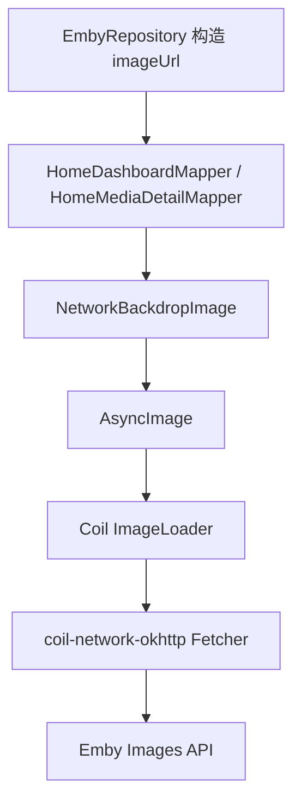

# 技术设计: 修复 Emby 封面图片不显示

## 技术方案
### 核心技术
- Coil 3.4.0
- Coil OkHttp 网络模块: `io.coil-kt.coil3:coil-network-okhttp`
- Gradle Version Catalog

### 实现要点
- 在 `gradle/libs.versions.toml` 中新增 `coil-network-okhttp` library alias，版本继续复用 `coil = "3.4.0"`。
- 在 `app/build.gradle.kts` 中增加 `implementation(libs.coil.network.okhttp)`。
- 保持 `AsyncImage` 调用不变。Coil 3 在运行时检测到网络模块后会自动支持 HTTP/HTTPS URL。
- 使用 Gradle 依赖树验证 `debugRuntimeClasspath` 中出现 `io.coil-kt.coil3:coil-network-okhttp:3.4.0`。

## 设计边界
- **范围内:** 只补 Coil 网络加载依赖和相关文档。
- **范围外:** 不改 `EmbyStreamUrlBuilder`，不改变图片 URL 中是否带 token，不新增全局 `ImageLoader`，不重写 `NetworkBackdropImage`。
- **模块职责:** build 负责声明图片网络加载依赖；ui 继续通过 `NetworkBackdropImage` 渲染图片；data 继续负责构造 Emby 图片 URL。
- **接口契约:** 无 Kotlin 公共 API 或 Emby HTTP API 签名变更。
- **数据边界:** 无数据库、凭证或领域模型变更。
- **依赖边界:** 仅新增 Coil 官方网络模块，版本与当前 Coil Compose 保持一致；不升级 Coil、不替换 OkHttp。
- **大型项目最小改动:** 修改 2 个构建文件和必要知识库文档，不做 UI 重构或批量格式化。

## 架构设计

## 架构决策 ADR
### ADR-009: 使用 Coil 官方 OkHttp 网络模块修复网络图片加载
**上下文:** Coil 3 的 core/compose 模块不默认包含网络图片加载能力，当前 APK 运行时依赖树缺少 `coil-network-*`，导致所有 Emby HTTP 图片 URL 无法加载。  
**决策:** 增加 `io.coil-kt.coil3:coil-network-okhttp:3.4.0`，复用项目已有 OkHttp 生态。  
**理由:** 这是 Coil 官方推荐的 Android/JVM 网络图片支持方式，改动最小，能直接修复 `AsyncImage` 加载 HTTP/HTTPS URL 的根因。  
**替代方案:** 自定义全局 `ImageLoader` + OkHttpClient → 被拒绝原因: 当前无需定制请求头或缓存策略，会扩大改动；改用 Ktor 网络模块 → 被拒绝原因: 项目网络栈已使用 OkHttp。  
**影响:** APK 体积略增；图片网络请求由 Coil 的 OkHttp fetcher 处理。

## API设计
无 Emby API 变更。

## 数据模型
无数据模型变更。

## 安全与性能
- **安全:** 不在图片 URL、日志或文档中记录 Emby token；本方案不新增敏感信息传递。
- **安全:** 保持现有 `network_security_config`，不扩大 Android 权限。
- **性能:** Coil 网络模块启用后，图片可使用 Coil 自身内存/磁盘缓存能力；不额外预加载媒体库图片。
- **兼容:** 维持 Coil 版本一致，避免跨版本依赖冲突。

## 测试与部署
- **测试:** 运行 `.\gradlew.bat :app:dependencies --configuration debugRuntimeClasspath`，确认包含 `coil-network-okhttp:3.4.0`。
- **测试:** 运行 `.\gradlew.bat :app:testDebugUnitTest`。
- **构建:** 运行 `.\gradlew.bat :app:assembleDebug`。
- **手工验收:** 安装 Debug APK 后登录 Emby，确认首页媒体库封面、媒体卡片封面和详情页海报不再全部显示占位。
- **回滚:** 移除 `coil-network-okhttp` 依赖 alias 和 App 模块 implementation 即可回滚。
