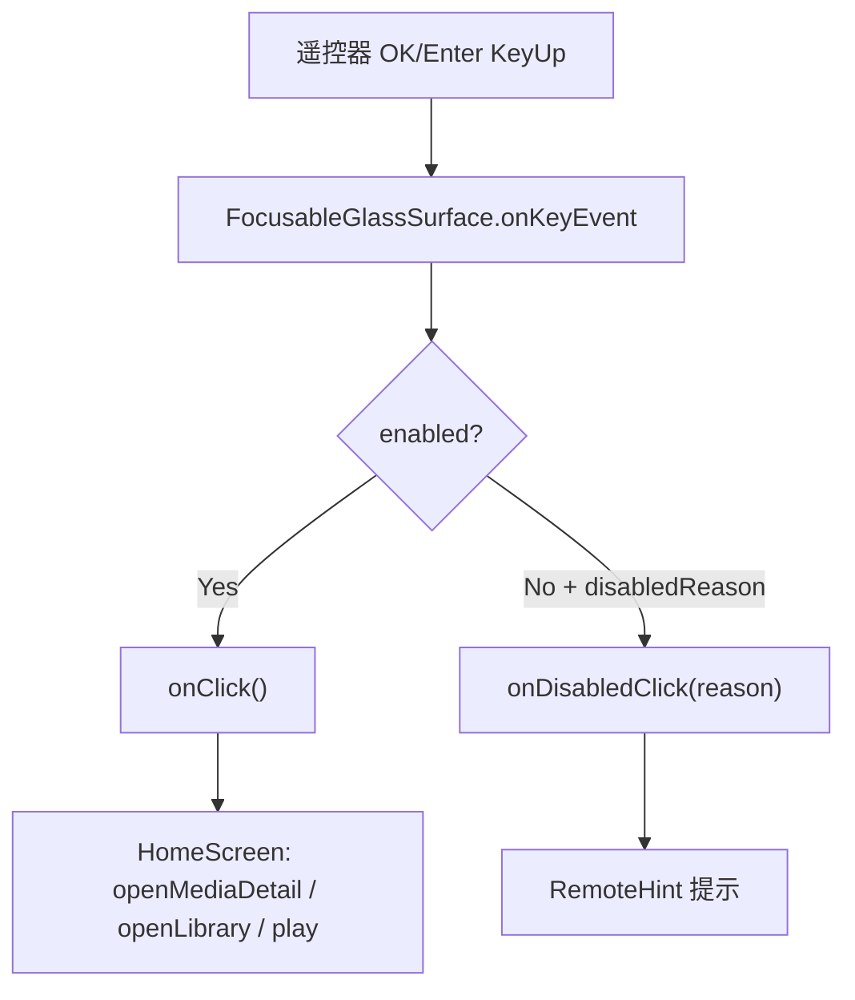

# 技术设计: 修复遥控器 OK 需要按两次才进入详情

## 技术方案
### 核心技术
- Jetpack Compose Focus
- Compose Key Input: `onKeyEvent`
- Android TV 遥控器键: `DirectionCenter`、`Enter`、`NumPadEnter`

### 实现要点
- 在 `FocusableGlassSurface` 的 modifier 链中加入 `onKeyEvent`。
- 当事件为 `KeyEventType.KeyUp` 且 key 属于 `DirectionCenter`、`Enter`、`NumPadEnter` 时：
  - 如果 `enabled && onClick != null`，调用 `onClick()` 并返回 `true`。
  - 如果 `!enabled && disabledReason != null && onDisabledClick != null`，调用 `onDisabledClick(disabledReason)` 并返回 `true`。
  - 其他情况返回 `false`。
- 保留现有 `Modifier.clickable`，确保鼠标/触摸仍可点击。
- 不修改 `HomeScreen` 中 Movie/Series 打开详情的业务分支。

## 设计边界
- **范围内:** 统一修复所有复用 `FocusableGlassSurface` 的遥控器 OK 行为。
- **范围外:** 不改播放器页根容器的 OSD 按键处理；播放器 OSD 内部复用 `FocusableGlassSurface` 的按钮会自然受益，但不额外重写播放控制逻辑。
- **模块职责:** ui/components 提供单次 OK 可点击的基础焦点面板；ui/home 继续只负责将卡片点击映射到详情、播放或列表导航。
- **接口契约:** `FocusableGlassSurface` 对外参数保持不变，不新增调用方负担。
- **数据边界:** 无数据变更。
- **依赖边界:** 不新增第三方依赖。
- **大型项目最小改动:** 只改通用组件的按键处理和必要测试/文档，不做 UI 层级重构。

## 架构设计

## 架构决策 ADR
### ADR-010: 在通用可聚焦面板统一处理 TV OK 键
**上下文:** 多个 TV 页面都通过 `FocusableGlassSurface` 组合 `focusable` 和 `clickable`。遥控器 OK 在部分场景下需要按两次才触发点击，说明依赖默认 clickable 语义不足以稳定覆盖 TV 遥控器。  
**决策:** 在 `FocusableGlassSurface` 内显式捕获 OK/Enter KeyUp 并触发对应点击回调。  
**理由:** 这是最小改动，覆盖所有复用该基础组件的卡片、抽屉项和图标按钮，避免在每个调用点重复写 key handler。  
**替代方案:** 在每个 `MediaPosterCard`、`LibraryCard`、`RoundIconButton` 分别处理按键 → 被拒绝原因: 重复且容易遗漏；移除 `clickable` 只保留 key handler → 被拒绝原因: 可能影响触摸/鼠标点击和无障碍语义。  
**影响:** TV 遥控器 OK 行为更直接；需要验证不会重复触发点击。

## API设计
无外部 API 变更。

## 数据模型
无数据模型变更。

## 安全与性能
- **安全:** 不涉及网络、凭证、token、密码或文件权限。
- **性能:** key handler 只在焦点控件按键事件上执行，性能影响可忽略。
- **兼容:** 保留 `clickable`，避免影响非遥控器输入；仅消费 OK/Enter KeyUp 事件。

## 测试与部署
- **测试:** 优先增加针对 `FocusableGlassSurface` 的 Compose/UI 行为测试；如当前测试环境不适合引入 Compose UI 测试，则记录 TDD-EXEMPT 并使用构建验证 + 真机手工验收。
- **验证:** 运行 `.\gradlew.bat :app:testDebugUnitTest`。
- **构建:** 运行 `.\gradlew.bat :app:assembleDebug`。
- **手工验收:** 安装 APK 后用遥控器验证：媒体卡片一次 OK 进入详情、媒体库卡片一次 OK 进入资源列表、收藏卡片一次 OK 进入详情、禁用入口一次 OK 显示提示。
- **回滚:** 移除 `FocusableGlassSurface` 中新增的 `onKeyEvent` 分支即可恢复原行为。
