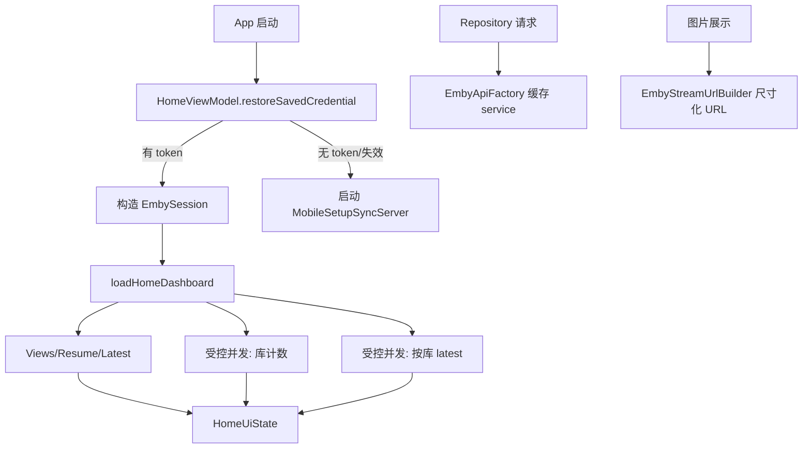

# 技术设计: TV 客户端性能优化

## 技术方案
### 核心技术
- Kotlin Coroutines / Flow
- Retrofit + OkHttp
- Coil 3 / Emby 图片端点
- Android TV Compose

### 实现要点
- `HomeViewModel` 启动时先读取 `SavedEmbyCredential`，只有无凭证或凭证失效时启动 `MobileSetupSyncServer`。
- `EmbyRepository.loadHomeDashboard()` 将可独立请求拆分为并发任务；对按库计数和按库 latest 设置并发上限，避免媒体库数量放大时完全串行。
- `EmbyApiFactory` 对 `(normalizedBaseUrl, accessToken)` 缓存 `EmbyApi` service，避免重复构造 Retrofit 和 token query interceptor。
- `EmbyStreamUrlBuilder` 增加图片用途或尺寸参数，构造 `MaxWidth`、`MaxHeight`、`Quality` 等 Emby 图片查询参数。
- 播放上报队列化先作为独立可选任务：若核心优化已覆盖主要瓶颈，可延期到单独方案，避免扩大本次风险。

## 设计边界
- **范围内:** 启动恢复、首页数据加载、API service 复用、图片尺寸化、必要测试与文档。
- **范围外:** 不新增离线缓存数据库；不改变 Emby 登录请求；不改变保存凭证字段；不重写 UI 结构；不改变播放器核心播放逻辑。
- **模块职责:** `ui/home` 管理启动和 UI 状态；`data/repository` 负责聚合与并发加载；`data/remote` 负责 API service 创建与复用；`data/repository/EmbyStreamUrlBuilder` 负责 Emby URL 构造；`ui/components` 继续只负责展示图片。
- **接口契约:** 外部 UI 调用保持不变；内部可为 `EmbyStreamUrlBuilder` 增加带尺寸参数的方法或参数对象；`EmbyApiProvider.create()` 签名优先保持不变。
- **数据边界:** 本地凭证结构不变；不迁移 SharedPreferences；不保存密码。
- **依赖边界:** 不新增第三方依赖。
- **大型项目最小改动:** 优先修改直接相关文件，不做目录搬迁、公共模型重命名或大范围 UI 重构；任何复杂播放上报队列化如影响面过大则拆分延期。

## 架构设计


## 架构决策 ADR
### ADR-011: 首页性能优化采用启动顺序调整与受控并发而非本地持久缓存
**上下文:** 首页主要慢点来自启动时不必要的扫码服务启动，以及 Dashboard 串行聚合大量 Emby 请求。  
**决策:** 先调整启动恢复顺序，并将 Dashboard 独立请求改为受控并发或分阶段加载；暂不引入数据库或磁盘缓存。  
**理由:** 这是低风险高收益改动，不改变数据一致性模型，也不引入缓存失效复杂度。  
**替代方案:** 新增本地持久缓存首页数据 → 被拒绝原因: 需要缓存失效、刷新策略和数据迁移，超出当前性能修复切片。  
**影响:** 冷启动和首页首屏可更快响应；需要控制并发上限避免压垮 Emby 服务端。

### ADR-012: API service 按 baseUrl 和 token 复用
**上下文:** 当前每个 Repository 方法都会新建 OkHttp wrapper 和 Retrofit service。  
**决策:** 在 `EmbyApiFactory` 内按 normalized baseUrl 与 accessToken 缓存 `EmbyApi`。  
**理由:** 不改变 Repository 调用方式即可减少重复对象创建，并降低播放上报等频繁请求的额外开销。  
**替代方案:** 动态 request tag 注入 token 的单 Retrofit 实例 → 被拒绝原因: 改动面更大，容易引入 token 传播错误。  
**影响:** 需要保证 token 或服务器变化时使用新 cache key。

## API设计
无外部 API 变更。

## 数据模型
无持久化数据模型变更。

可新增内部模型示例：
```kotlin
enum class EmbyImageProfile(val maxWidth: Int, val maxHeight: Int, val quality: Int)
```

## 安全与性能
- **安全:** 继续只保存 token，不保存密码；API 缓存 key 不写日志；播放 URL 和 api_key 不输出到错误文案。
- **性能:** 减少冷启动无效服务启动；减少 Dashboard 串行等待；减少 Retrofit service 重复构造；减少超大图片下载和解码。

## 测试与部署
- **测试:** 为启动恢复顺序、API 缓存、图片 URL 参数和 Dashboard 聚合增加单元测试；必要时为并发加载使用 fake API 验证请求次数和结果。
- **验证:** 运行 `.\gradlew.bat :app:testDebugUnitTest`。
- **构建:** 运行 `.\gradlew.bat :app:assembleDebug`。
- **手工验收:** 已保存 token 后冷启动不显示扫码服务闪烁；首页可正常展示媒体库、继续观看和按库最新资源；图片清晰且加载速度可接受；凭证失效仍回到登录配置。
- **回滚:** 恢复 `HomeViewModel.init()` 原顺序、移除 API 缓存和图片尺寸参数即可回到旧行为。
