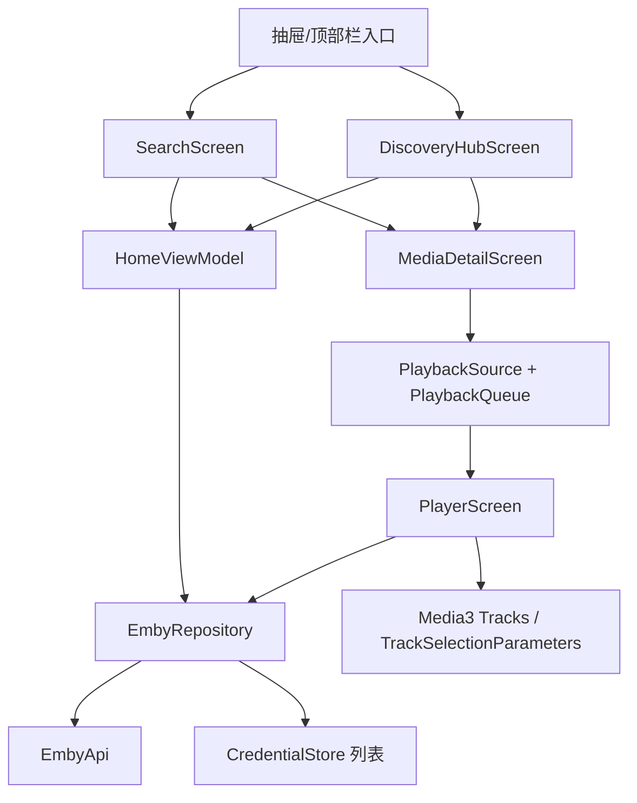

# 技术设计: Emby TV 客户端功能补齐

## 技术方案
### 核心技术
- Kotlin + MVVM + StateFlow。
- Retrofit + OkHttp 调用 Emby API。
- Jetpack Compose + TV Compose 实现遥控器可操作页面。
- AndroidX Media3 `Tracks` / `TrackSelectionParameters` 实现本地音轨和字幕切换。
- Android `RecognizerIntent` 作为语音搜索入口，设备不可用时回退手动搜索。

### 官方与实测资源调研
- Emby `Users/{UserId}/Items` 支持按 `SearchTerm`、`IncludeItemTypes`、`Recursive`、`Fields` 查询媒体资源，用于搜索和按条件列表。参考: https://dev.emby.media/reference/RestAPI/UserLibraryService.html
- Emby `Sessions/Playing*` 已接入；本次继续复用 `PlaybackInfo.MediaSources[].MediaStreams` 作为轨道标题和初始轨道元数据。参考: https://dev.emby.media/doc/restapi/Playback-Check-ins.html
- Emby `Shows/NextUp` 可作为下一集和首页 Next Up 的候选来源；当前测试服返回 0，仍需实现空状态。参考: https://dev.emby.media/reference/RestAPI/TvShowsService.html
- Emby `PlaystateService` 提供已播放、收藏等用户态写接口；清除继续观看进度基于 UserData 更新能力实现，执行时需先在测试服验证行为。参考: https://dev.emby.media/reference/RestAPI/PlaystateService.html
- Emby `PlaylistService` 提供播放列表条目读取能力；列表入口可通过 `IncludeItemTypes=Playlist` 查询，详情用 `Playlists/{Id}/Items`。参考: https://dev.emby.media/reference/RestAPI/PlaylistService.html
- Emby `GenresService` 和 `PersonsService` 可读取类型、演员条目；资源详情通过 `Users/{UserId}/Items` 的 `GenreIds` / `PersonIds` 查询。参考: https://dev.emby.media/reference/RestAPI/GenresService.html、https://dev.emby.media/reference/RestAPI/PersonsService.html
- AndroidX Media3 官方推荐通过 track selection parameters 和 track override 选择音频/字幕轨道。参考: https://developer.android.com/media/media3/exoplayer/track-selection
- Android TV 搜索/语音输入优先使用系统能力，手动输入作为兜底。参考: https://developer.android.com/training/tv/discovery/searchable

### 测试服只读探测结论
- 2026-05-29 使用用户提供的测试 Emby 服务器完成只读探测；未执行收藏、已播放、清除进度等写接口。
- `/Genres` 返回 47 条类型，Genre 条目有 `Id`、`Name`、`Type=Genre` 和 Primary 图片；`GenreIds={id}` 可反查 Movie/Series。
- `/Persons` 返回 53881 条演员/人物，Person 条目有 `Id`、`Name`、`Type=Person` 和 Primary 图片；从影片 People 字段取到演员 `PersonIds={id}` 可反查 Movie。
- 搜索接口能返回 `Items`，但测试中 `TotalRecordCount` 可能为 0，因此 UI 不能只依赖总数字段判断空状态。
- 当前测试服暂无 BoxSet 和 Playlist 数据，必须保留空状态和兼容分支。

### 实现要点
- 复用现有 `MediaItemSummary`、详情页、列表页和 `MediaPosterCard`，新增通用发现页面模型，避免为合集/播放列表/类型/演员重复四套 UI。
- 所有新增页面必须遵循 TV 遥控器契约：初始焦点、方向键导航、OK/Enter 操作、Back 返回、禁用态可读反馈。
- 数据层新增 API 保持可空 DTO，Repository 统一返回 `Result`，UI 不直接处理 Retrofit。
- 搜索输入使用 debounce，避免遥控器输入时每个按键都触发请求；空关键词显示最近/推荐入口，不请求全库。
- 写操作采用“请求中禁用按钮 + 成功刷新局部状态 + 失败回滚”的策略。
- 播放队列优先来自当前季 Episode 列表；从继续观看或搜索结果直接播放 Episode 时，按需拉取同季 Episode 补队列。
- 多凭证存储保持不保存密码，只保存 `serverUrl`、`userId`、`username`、`accessToken`、`serverId`、`deviceId`、保存时间。

## 设计边界
- **范围内:** 新增搜索、发现页、播放轨道切换、连续播放、用户态写操作、多凭证选择。
- **范围外:** 转码、服务端管理、播放列表/合集编辑、Live TV、音乐库完整体验。
- **模块职责:** 
  - `data/remote`: 只定义 Emby HTTP 契约和 DTO。
  - `data/repository`: 聚合 Emby API、图片 URL、分页参数、写操作状态刷新。
  - `domain/model`: 提供 UI 无关模型，如搜索结果、发现分组、播放队列、用户操作状态。
  - `ui/home`: 页面导航、搜索、发现页、详情页动作按钮。
  - `ui/player`: Media3 轨道选择、剧集队列、自动连播。
  - `data/local`: 多凭证加密保存和旧数据迁移。
- **接口契约:** 不改变现有登录、首页、媒体库、收藏和详情公开行为；新增 Repository 方法，并扩展 `PlaybackSource` 携带 `PlaybackQueue`。
- **数据边界:** 本地加密凭证结构升级为列表；需兼容读取旧单对象 JSON 并迁移为列表。不会保存密码。
- **依赖边界:** 不新增第三方依赖；语音搜索使用 Android 系统 intent；轨道切换使用现有 Media3。
- **大型项目最小改动:** 不重构整体导航框架；优先在现有 `HomeViewModel` 和 `HomeScreen` 中增量添加状态，若文件过大再拆出同包 Composable 文件。

## 架构设计


## 架构决策 ADR
### ADR-013: 使用通用发现页承载合集、播放列表、类型、演员
**上下文:** 四类入口都需要卡片列表、详情列表、空/错/加载状态和遥控器焦点。
**决策:** 新增通用 `DiscoveryContentUiState` 和 `DiscoveryContentScreen`，用 `DiscoveryKind` 区分 BoxSet、Playlist、Genre、Person。
**理由:** 降低 UI 重复，保证 TV 焦点和卡片展示一致。
**替代方案:** 为四类入口分别实现页面 → 拒绝原因: 文件和状态重复，后续分页/排序成本更高。
**影响:** 初期模型需要覆盖不同条目字段，但可通过 `MediaItemSummary` 和少量 `DiscoveryEntrySummary` 统一。

### ADR-014: 播放轨道切换以 Media3 当前 Tracks 为准
**上下文:** Emby `PlaybackInfo.MediaStreams` 有 Index、语言和标题，但 Media3 实际解析出的 track group 才能决定可切换项。
**决策:** OSD 面板展示以 Media3 `player.currentTracks` 为真实来源，Emby `PlaybackDetails` 用于进入播放前的标题兜底和日志无关 UI 文案。
**理由:** 直接流、封装格式、外部字幕和设备解码能力可能导致 Emby stream index 与 Media3 track group 不完全一致。
**替代方案:** 只按 Emby stream index 切换 → 拒绝原因: 容易选不到实际轨道或在部分容器中失败。
**影响:** `PlayerScreen` 需要监听 `onTracksChanged` 并维护 `PlayerTrackUiState`。

### ADR-015: 多凭证采用兼容迁移而非清空旧凭证
**上下文:** 当前版本已经保存单条 Emby token 凭证。
**决策:** `EncryptedEmbyCredentialStore` 读取时先尝试列表格式，失败后按旧单条格式读取并迁移为列表。
**理由:** 避免升级后用户被迫重新登录。
**替代方案:** 清空旧凭证重新登录 → 拒绝原因: 用户体验差，也无法验证 token 恢复路径。
**影响:** 需要新增凭证列表模型和迁移测试。

## API设计
### GET Users/{userId}/Items?SearchTerm={query}
- **请求:** `Recursive=true`、`IncludeItemTypes=Movie,Series,Episode,BoxSet,Playlist`、`Fields=MEDIA_ITEM_FIELDS`、`EnableUserData=true`、分页参数。
- **响应:** `EmbyItemsResponse`，UI 以 `Items` 是否为空判断结果，不只依赖 `TotalRecordCount`。

### GET Shows/NextUp
- **请求:** `UserId`、`Limit`、`Fields=MEDIA_ITEM_FIELDS`，可选 `SeriesId`。
- **响应:** Episode 列表，用于首页 Next Up 和直接播放剧集时补队列。

### POST/DELETE Users/{userId}/FavoriteItems/{itemId}
- **请求:** 无 body，认证头携带 token。
- **响应:** 成功后刷新目标 item 详情或局部更新 `UserData.IsFavorite`。

### POST/DELETE Users/{userId}/PlayedItems/{itemId}
- **请求:** 无 body或按 Emby 要求携带 `DatePlayed`；实现前以官方文档和测试服确认最终参数。
- **响应:** 成功后刷新播放状态、继续观看列表和详情状态。

### POST Users/{userId}/Items/{itemId}/UserData
- **请求:** 用于清除继续观看进度，目标为 `PlaybackPositionTicks=0`；该接口行为需在测试服先做一次手动确认。
- **响应:** 成功后从继续观看移除或进度归零。

### GET Users/{userId}/Items?IncludeItemTypes=BoxSet
- **请求:** `Recursive=true`、`Fields=MEDIA_ITEM_FIELDS`、分页排序。
- **响应:** BoxSet 列表；为空时展示“暂无合集”。

### GET Users/{userId}/Items?ParentId={boxSetId}
- **请求:** `IncludeItemTypes=Movie,Series`、`Fields=MEDIA_ITEM_FIELDS`。
- **响应:** 合集内资源。

### GET Users/{userId}/Items?IncludeItemTypes=Playlist
- **请求:** `Recursive=true`、分页排序。
- **响应:** Playlist 列表。

### GET Playlists/{playlistId}/Items
- **请求:** `UserId`、分页、`Fields=MEDIA_ITEM_FIELDS`。
- **响应:** 播放列表条目；需要读取 `PlaylistItemId` 但本方案不做编辑。

### GET Genres
- **请求:** `UserId`、分页、`Recursive=true`、排序。
- **响应:** Genre 列表。

### GET Users/{userId}/Items?GenreIds={genreId}
- **请求:** `IncludeItemTypes=Movie,Series`、分页。
- **响应:** 类型下资源。

### GET Persons
- **请求:** `UserId`、分页、`Recursive=true`、排序。
- **响应:** Person 列表。

### GET Users/{userId}/Items?PersonIds={personId}
- **请求:** `IncludeItemTypes=Movie,Series`、分页。
- **响应:** 演员关联资源。

## 数据模型
```kotlin
enum class DiscoveryKind { Collections, Playlists, Genres, Persons }

data class DiscoveryEntrySummary(
    val id: String,
    val name: String,
    val type: String,
    val kind: DiscoveryKind,
    val imageUrl: String?,
    val itemCount: Int?,
)

data class EmbyDiscoveryContent(
    val kind: DiscoveryKind,
    val entries: List<DiscoveryEntrySummary>,
)

data class DiscoveryEntryItems(
    val entry: DiscoveryEntrySummary,
    val items: List<MediaItemSummary>,
)

data class EmbySearchResults(
    val query: String,
    val items: List<MediaItemSummary>,
)

data class PlaybackQueue(
    val previous: MediaItemSummary?,
    val current: MediaItemSummary,
    val next: MediaItemSummary?,
    val autoPlayNext: Boolean = true,
)

data class SavedEmbyCredentialList(
    val credentials: List<SavedEmbyCredential>,
)
```

## 安全与性能
- **安全:** 不保存密码；不在日志、错误文案、方案执行记录中输出 token；写操作失败时不暴露完整 URL；删除凭证和清除进度需要二次确认。
- **权限:** 所有 Emby 写接口仅对当前登录用户 ID 执行，不允许跨用户改状态。
- **性能:** 搜索 debounce 300-500ms；发现页分页 `Limit=60`；演员页数量巨大，默认分页 + 搜索，不一次性拉取全量；首页只增加 Next Up 小数量请求。
- **兼容:** BoxSet、Playlist 为空或服务器不支持时展示空状态；`TotalRecordCount` 不可靠时以 `Items` 为准。

## 测试与部署
- **测试:** 新增 Repository fake API 单元测试、Mapper 单元测试、Player reducer/track state 单元测试、凭证迁移测试。
- **验证命令:** `.\gradlew.bat :app:testDebugUnitTest` 和 `.\gradlew.bat :app:assembleDebug`。
- **手工验证:** TV 遥控器焦点路径、搜索输入、语音回退、播放器 OSD 轨道选择、剧集自动连播、收藏/已播放写操作。
- **部署:** 本地 debug APK 验证通过后再提交推送；如涉及版本发布由用户另行指定是否修改版本号。
