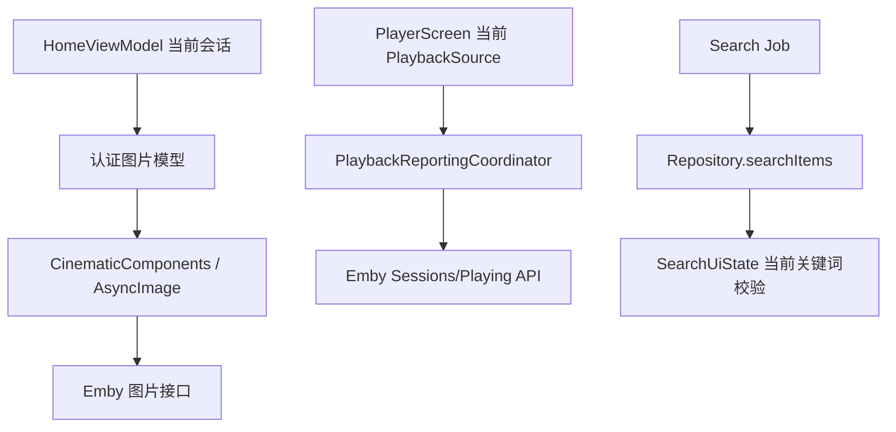

# 技术设计: Emby TV 审查问题修复

## 技术方案
### 核心技术
- Kotlin + Jetpack Compose / TV Compose
- AndroidX Media3 Player
- Coil 图片加载
- Kotlin Coroutines / Flow
- Retrofit + OkHttp

### 实现要点
- 播放器上报相关 effect 绑定当前 `playbackSource`，或使用 `rememberUpdatedState` 保证异步回调读取最新 source；手动切集前显式触发当前 source stopped。
- 图片加载从纯字符串 URL 升级为可携带认证 header 的模型，优先通过 Coil `ImageRequest.Builder.addHeader("X-Emby-Authorization", ...)` 传入认证，不把 Token 拼入可见 UI。
- 搜索逻辑改为单一可取消 Job，debounce 与网络请求在同一协程中执行，或以当前 query 校验写回。
- 删除凭证、清除播放进度引入 `ConfirmDialogUiState` 或局部确认状态，所有破坏性操作经二次确认入口执行。
- 版本号统一通过 `BuildConfig.VERSION_NAME` 或集中常量注入 `EmbyRepository` 和 UI，避免硬编码。

## 设计边界
- **范围内:** 修复审查发现的播放上报、图片认证、搜索取消、危险操作确认、版本号一致性。
- **范围外:** 不新增 Emby 服务端接口；不替换播放器；不改造整体导航结构；不新增数据库或迁移。
- **模块职责:** 
  - `ui/player`: 负责播放生命周期、遥控器操作与上报事件触发。
  - `data/repository`: 负责 Emby 请求、认证头构造、播放上报参数。
  - `ui/components`: 负责媒体卡片图片加载入口。
  - `ui/home`: 负责搜索状态、凭证删除确认、清除进度确认。
- **接口契约:** 
  - `PlaybackSource` 可按需携带图片认证所需 session/deviceId，避免 UI 直接拼接敏感信息。
  - `EmbyRepository` 的认证头构造应接收版本来源，默认行为保持兼容。
  - UI 回调签名尽量局部调整，不重命名公共领域模型。
- **数据边界:** 不改变已保存凭证结构；继续只保存用户名、server/user 标识、accessToken、deviceId，不保存密码。
- **依赖边界:** 不新增第三方依赖；复用现有 Coil、Media3、Coroutines。
- **大型项目最小改动:** 仅修改直接相关文件；不做目录搬迁、依赖升级、全局主题重构或公共 API 大改。回滚方式为撤回本方案包对应提交。

## 架构设计

## 架构决策 ADR
### ADR-202605291303: 图片认证优先使用请求 Header
**上下文:** Emby 图片接口在部分服务器配置下需要认证，纯 URL 加载可能返回 401/403。  
**决策:** 优先以 Coil `ImageRequest` 注入 Emby 认证 header，而不是把 Token 固定拼到 URL。  
**理由:** Header 方式减少 Token 暴露在 UI 文本、缓存键、日志和截图中的概率。  
**替代方案:** URL 增加 `api_key` → 拒绝原因: 实现简单但泄漏面更大。  
**影响:** 图片组件需要能拿到当前 session/deviceId 或已构造的认证 header；测试需要覆盖 header 存在性。

### ADR-202605291304: 播放切集上报由当前播放源驱动
**上下文:** Player 对象被复用，异步 effect 容易捕获旧 source。  
**决策:** 上报事件必须绑定当前 `PlaybackSource`，切集前显式停止旧 source，新 source 重新 started/progress。  
**理由:** Emby 后台播放状态以 itemId/playSessionId 为核心，错绑会污染继续观看与后台管理。  
**替代方案:** 每次切集销毁整个 PlayerScreen → 拒绝原因: 改动大且可能影响播放体验。  
**影响:** 需要为切集、退出、自动下一集补充测试或最小可验证路径。

## API设计
### Emby 图片请求
- **请求:** `GET /Items/{itemId}/Images/{imageType}`，通过图片加载请求 header 携带 `X-Emby-Authorization` 或等效认证。
- **响应:** 图片二进制流。

### Emby 播放上报
- **保持:** `POST Sessions/Playing`、`POST Sessions/Playing/Progress`、`POST Sessions/Playing/Stopped`。
- **变更:** 客户端确保 itemId、mediaSourceId、playSessionId 来自当前播放源。

## 数据模型
无本地持久化数据模型变更。

## 安全与性能
- **安全:** Token 不写入日志，不展示到 UI，不进入异常消息；危险操作需二次确认；清除进度和删除凭证默认可取消。
- **性能:** 搜索取消减少无效请求写回；播放上报避免旧 source 重复发送；图片认证 header 不应破坏 Coil 缓存，但需避免把 Token 作为可见 URL。

## 测试与部署
- **测试:** 运行 `.\gradlew.bat :app:testDebugUnitTest`；重点补充搜索取消、版本号、播放上报切集、危险操作确认相关测试。必要时手工安装 APK 验证真实 Emby 封面。
- **部署:** 本地通过单元测试与 `:app:assembleDebug` 后再提交；不需要后端部署。
