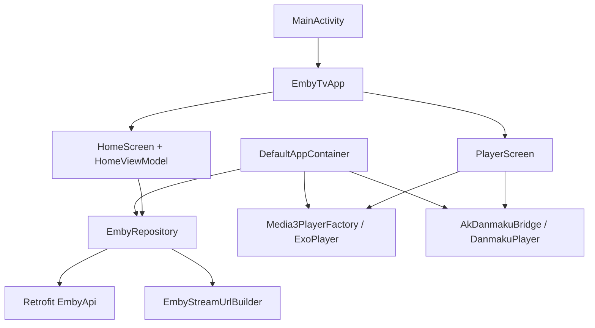
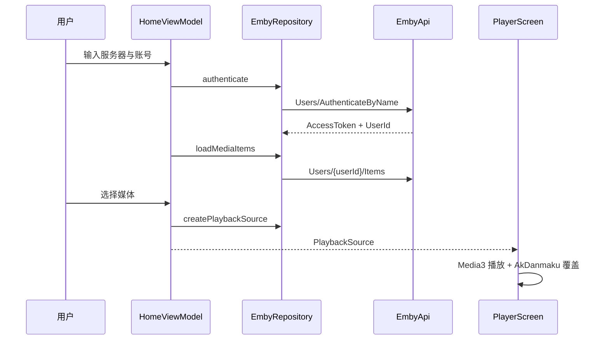

# 架构设计

## 总体架构

## 技术栈
- **客户端:** Android TV / Kotlin / Compose
- **网络:** Retrofit + OkHttp
- **播放:** AndroidX Media3 + 本地 FFmpeg 扩展预留
- **弹幕:** AkDanmaku
- **状态管理:** ViewModel + StateFlow

## 核心流程

## 重大架构决策
完整的 ADR 存储在各变更的 how.md 中，本章节提供索引。

| adr_id | title | date | status | affected_modules | details |
|--------|-------|------|--------|------------------|---------|
| ADR-001 | 使用本地 AAR 预留 Media3 FFmpeg 扩展 | 2026-05-20 | ✅已采纳 | player, build | [how.md](../history/2026-05/202605201342_emby_tv_init/how.md#adr-001-使用本地-aar-预留-media3-ffmpeg-扩展) |
